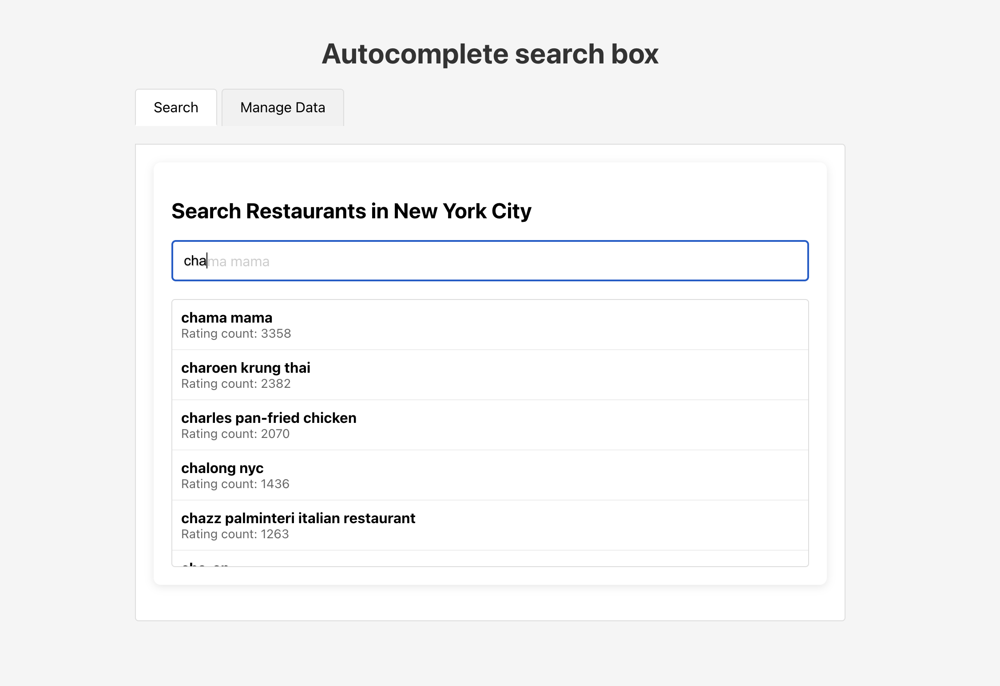

# Restaurant Autocomplete

A full-stack application that provides fast and efficient autocomplete suggestions for any list of names (New York restaurants in this case) using a Trie data structure.

<p align="center">
  
  <br>
  <em>Restaurant search autocomplete in action: Showing search results for "nan xian"</em>
</p>

## Project Overview

This application demonstrates an efficient approach to implementing autocomplete functionality:

- **Backend**: Python FastAPI server with a Trie-based search algorithm
- **Frontend**: React/TypeScript UI with debounced search input

## How It Works

### Autocomplete with Trie Data Structure

This project uses a **Trie** (prefix tree) to efficiently find restaurant names that match a given prefix:

1. **Trie Structure**: Each node in the Trie represents a character. Words that share prefixes share the same initial nodes.

2. **Initialization**: When the application starts, restaurant names are loaded into the Trie:
   - Each character in a name creates or traverses a node
   - The end of a name is marked as a terminal node

3. **Search Process**:
   - The algorithm navigates the Trie using the characters of the search prefix
   - Once it reaches the end of the prefix, it collects all complete words that can be formed from that point
   - Results are ranked based on restaurant rating counts

4. **Performance**: Trie lookups are O(k) where k is the length of the prefix, regardless of how many total restaurant names exist in the dataset.

## Getting Started

### Prerequisites

- Python 3.8+
- Node.js 14+
- npm

### Running the Application

1. **Start the Backend**:
   ```bash
   # From the project root
   python main_api.py
   ```
   The API will be available at http://localhost:8001/api

2. **Start the Frontend**:
   ```bash
   # From the frontend directory
   cd frontend
   npm start
   ```
   The UI will be available at http://localhost:3000

## Usage

1. First, initialize the data by clicking "Load Data" in the "Manage Data" tab
2. Use the search bar to type restaurant names and see autocomplete suggestions
3. You can add new restaurants in the "Manage Data" tab

## Project Structure

```
/query_autocomplete
  /backend           # Python FastAPI backend
    /api             # API endpoints
    /data            # Data processing
    /models          # Trie implementation
    /services        # Business logic
    /utils           # Utility functions
  /frontend          # React/TypeScript frontend
    /src             # Frontend source code
      /components    # React components
      /api.ts        # API client
  /data              # Data files
  main_api.py        # Backend entry point
```
